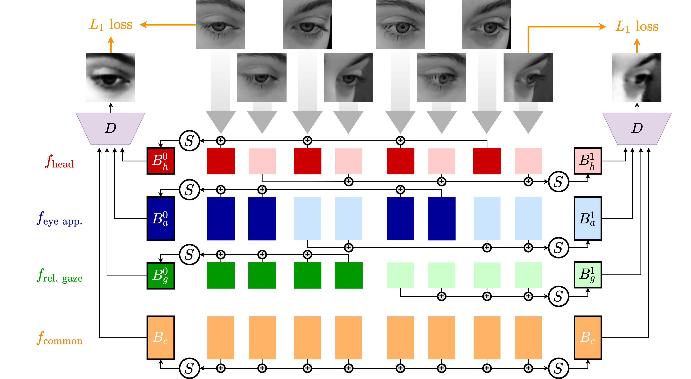

# Unsupervised Multi-View Gaze Representation Learning

The official implementation of <strong><em>Unsupervised Multi-View Gaze Representation Learning</em></strong> that has been accepted to the CVPR 2022 Gaze workshop.



## Conda Environment and Setup

Activate the conda environment:

```
conda env create -f conda_env.yaml
conda activate gaze
```

## Pre-processing EVE Dataset
After downloading the EVE dataset, it is first necessary to preprocess into a unified format. This step also resamples all data to 10 Hz and 3 second duration.

```
python src/preprocessing/eve.py --eve-raw-path /path/to/input_data --eve-preprocessed-path /path/to/output_data
```

## Running Experiments
All experiments are broken down into three phases:
1. Training the feature representation
2. Extracting the features
3. Estimating gaze using the features

To run all phases of the experiments at once, edit the [exps/example.txt](exps/example.txt) file as needed and run the following command:

```
./run_experiments.py --exp-txt exps/example.txt
```

### Citation

```
@InProceedings{Gideon_2022_CVPR_Gaze,
    author       = {Gideon, John and Su, Shan and Stent, Simon},
    title        = {Unsupervised Multi-View Gaze Representation Learning},
    booktitle    = {Proceedings of the IEEE/CVF Computer Vision and Pattern Recognition Conference (CVPR)},
    booksubtitle = {Workshop on Gaze Estimation and Prediction in the Wild},
    month        = {June},
    year         = {2022},
}
```

## License
This project is licensed under the Creative Commons Non Commercial License. See [LICENSE](../LICENSE) file for further information.
